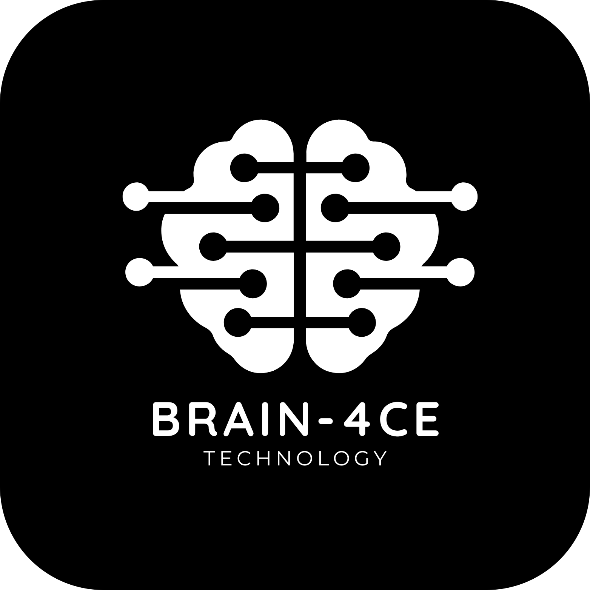

# **Brain-4ce** - An EEG-based Brain-Computer Interface

    
     
    <em>Where thoughts become motion.</em>

<h2 style="text-decoration: underline; text-align: center">Designed by BU ECE 2023 Senior Design Capstone Team 4</h2>

    
     
    <em>From left to right: Brendan Shortall, Mitchell Gilmore, Dayanna De La Torres, Jonathan Mikalov, Alexander Johnson</em>

 

# Table of Contents
- [**Brain-4ce** - An EEG-based Brain-Computer Interface](#brain-4ce---an-eeg-based-brain-computer-interface)
- [Table of Contents](#table-of-contents)
- [Abstract](#abstract)
- [Getting Started](#getting-started)
- [Current State of the Project](#current-state-of-the-project)
- [Lessons Learned](#lessons-learned)
- [Bug Fixes](#bug-fixes)

 

# Abstract
The ability to manipulate objects using only your mind is no longer a far-fetched idea. While It may sound like something out of science fiction, our team has turned this into a reality. We have created a headset that utilizes electroencephalogram (EEG) technology to quickly and accurately record a user's neural activity. Our state-of-the-art deep learning algorithm then decodes these signals into predefined motor-imagery tasks.

This breakthrough technology is integrated with a computer game that provides the user with an environment to navigate using their mind. With the Brain-4ce (pronounced "Brain Force") headset, users can perform four different actions: rotating clockwise, rotating counterclockwise, moving forward, and moving backward. Each action corresponds to a physical motion that the user imagines themselves doing.

Our team was inspired to develop this project by our aspiration to bridge the digital divide for those who are physically disabled. With the Brain-4ce headset, users will be able to operate a computer, a wheelchair, and virtually anything else using nothing but their thoughts! The possibilities are endless, and we are excited to see what the future holds.
  

# Getting Started
- Please refer to our [Hardware Setup Guide](./hardware/README_HARDWARE.md) for instructions on setting up the hardware.
- Please refer to our [Software Setup Guide](./Virtual%20Environment/README_SOFTWARE.md) for instructions on setting up the software.
  

# Current State of the Project
As it currently stands, our project has three major components:
1. A working [EEG data capture headset](./hardware/electrical/cyton%20wired/) that interfaces with a [Python application](./GUI/) to monitor and record brain activity in real time.
2. A [convolutional neural network machine learning algorithm](./Physionet%20Dataloader/), trained on the recorded brain activity, for classifying motor-imagery tasks observed from a user wearing the headset.
3. [2D](./2D%20Game/) and [3D](./Virtual%20Environment/) video games developed in Python to demonstrate the efficacy of the neural network's brain activity classification.

The software communicates in real time using socket programming techniques to achieve parallelism and multithreading.
  

# Lessons Learned
- Developing on Apple Silicon, and ARM-based processors in general, is tricky for this project. Certain libraries, such as the [ChipKIT Core library](https://chipkit.net/wiki/index.php?title=ChipKIT_core) for compiling firmware onto the microcontroller, lack proper support for ARM architecture. We recommend performing all software development on an x64-based Windows machine. Some development is possible on Intel-based macOS and Linux, but it will probably save you a lot of headache to stick to Windows if possible.
- The microcontroller appears to have USB functionality built-in, which might make the USB to UART conversion unnecessary. This may be something to examine in [the documentation](https://ww1.microchip.com/downloads/en/DeviceDoc/PIC32MX1XX2XX%20283644-PIN_Datasheet_DS60001168L.pdf) during a future continuation of this project.
- The ADS1299 chip from Texas Instruments remains [difficult to obtain](https://www.findchips.com/search/ADS1299) as of Q2 2023 due to the ongoing chip shortage. We tried using the ADS1296 chip in its place, but this was unsuccessful because of differing startup and common-mode rejection configurations between the chips.
- If future boards are manufactured, it may be worth considering [paying for them to be machine-assembled](https://jlcpcb.com/parts). Assembling the boards by hand takes a long time and requires a substantial amount of electrical rules checking to ensure no shorts or incontinuity between components.
- Obtaining good skin contact for all electrodes is crucial to ensure proper reading of brain activity.
- The [OpenBCI Forum](https://openbci.com/forum/index.php?p=/discussions) is a great place to turn to for help troubleshooting. As is [their documentation](https://docs.openbci.com).
  

# Bug Fixes
- [Incorrect start byte configuration](https://github.com/atjohnson/brain-4ce-old/issues/10) - fixes an issue where the data stream is incorrectly formatted because the obsolete RFduino did some packet changing which no longer happens due to our wired USB connection.
- [Enable OpenBCI GUI to work with USB to UART controller](https://github.com/atjohnson/brain-4ce-old/issues/11) - fixes an issue where OpenBCI's GUI is unable to detect the Cyton board due to an ID mismatch with the USB to UART bridge IC.
- [Set up chipKIT Core library to work on local machine](https://github.com/atjohnson/brain-4ce-old/issues/12) - fixes an issue where Arduino IDE is unable to compile the firmware because it cannot locate the PIC32 compiler applications.
- [RXT and TXT LEDs not flashing](https://github.com/BostonUniversitySeniorDesign/brain-4ce/issues/4) - fixes an issue where the RXT and TXT LEDs on the board indicating data transmission over UART do not flash because the USB to UART bridge's firmware is configured improperly.
