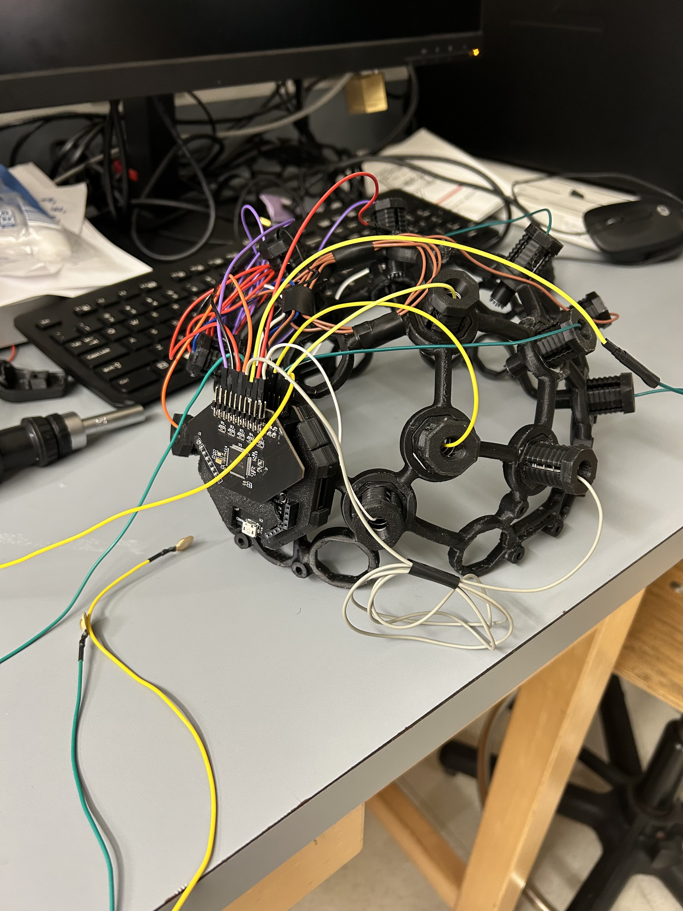
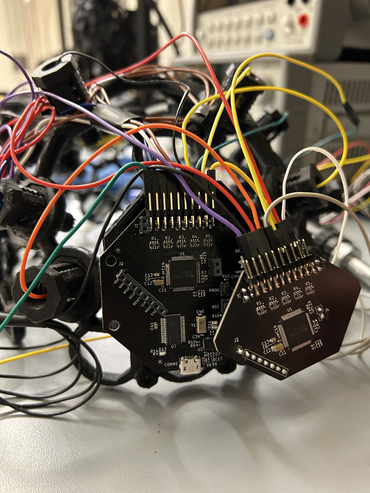
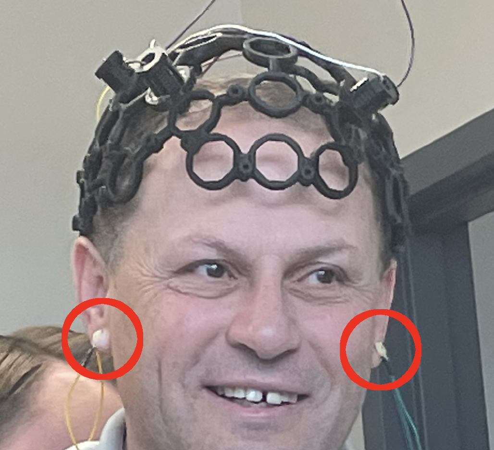

# Hardware Setup

  
  

 
 

The headset comes assembled out of the box with 16 electrodes placed in the rear of the headset body. The PCB is mounted in its casing on the back of the headset as well, with the probes attached to their correct pins.
1. Begin by attaching the included USB to the USB port that is visible on the Cyton board.
2. Plug the opposite end into any USB port on your PC. Ensure power is being sent to the board indicated by a blue LED on the top side of the Cyton. Once this LED is on, the hardware is ready to go.
3. If you would like to change the electrode positions, gently remove the probe by squeezing the sides of the outer electrode casing and pulling outwards. You should never change where the electrodes are connected to the boards, but if you choose to do so refer to the layout described in section 2.3.4 of the [User's Manual](../Documents/Team%204%20User's%20Manual.pdf).
4. Once you are ready to start the EEG system, connect an ear clip to each of your earlobes and place the headset on your head with the board on the back. Make sure that each of the probes is making contact with the scalp.

  

 
 

# Schematic/PCB/CAD Diagrams
- [Cyton Wired board schematic and PCB diagrams](./electrical/cyton%20wired/)
- [Cyton Daisy board schematic and PCB diagrams](./electrical/cyton%20daisy/)

# Bill of Materials
- [Cyton Wired BOM](./electrical/cyton%20wired/cyton%20wired%20bom.csv)
- [Cyton Daisy BOM](./electrical/cyton%20daisy/cyton%20daisy%20bom.csv)

# Significant Data Sheets
- [PIC32MX250F128B microcontroller](https://ww1.microchip.com/downloads/en/DeviceDoc/PIC32MX1XX2XX%20283644-PIN_Datasheet_DS60001168L.pdf)
- [ADS1299IPAG analog front end](https://www.ti.com/lit/ds/symlink/ads1299.pdf?HQS=dis-dk-null-digikeymode-dsf-pf-null-wwe&ts=1682901373303&ref_url=https%253A%252F%252Fwww.ti.com%252Fgeneral%252Fdocs%252Fsuppproductinfo.tsp%253FdistId%253D10%2526gotoUrl%253Dhttps%253A%252F%252Fwww.ti.com%252Flit%252Fgpn%252Fads1299)

# Power Requirements
- Micro USB to USB A power and data cable

# Vendor Information
- PCBs manufactured by [JLCPCB](https://jlcpcb.com)
- PCB surface mount components purchased from [Digi-Key](https://www.digikey.com)
- Headset components obtained from [OpenBCI](https://docs.openbci.com/AddOns/Headwear/MarkIV/?_gl=1*1e99fsi*_ga*NzI1MjAxMTkyLjE2ODI1MjkzNDM.*_ga_HVMLC0ZWWS*MTY4MjkwMDUzNC4zLjEuMTY4MjkwMDU0Ny40Ny4wLjA.)
- ADS1299 chips purchased from [AliExpress](https://www.aliexpress.us)
- PICKit 3 hardware debugger purchased from [Amazon](https://www.amazon.com)
- USB isolator purchased from [Adafruit](https://www.adafruit.com/product/2107)
