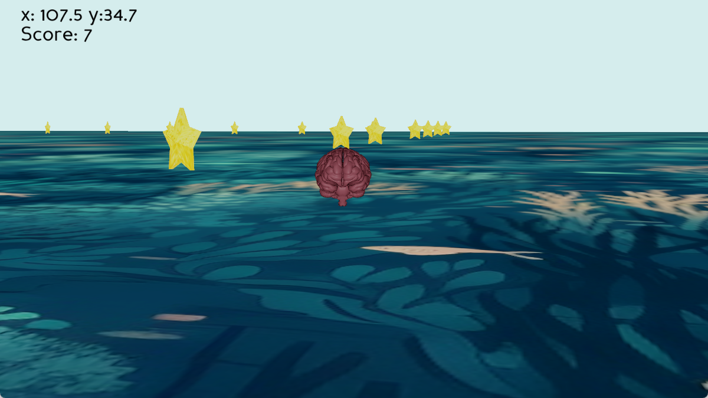
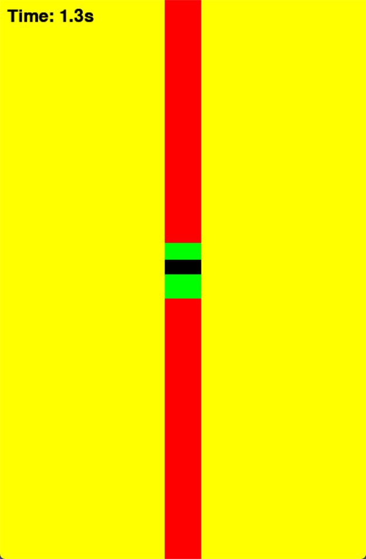

# Requirements
Make sure to install the required Python libraries. Running the command `pip install -r requirements.txt` will download each of the required libraries to successfully execute this project.

# Virtual Environment

 

To run the virtual environment: Execute `python /Virtual Environment/main.py`

The main objective is to collect as many stars within a given timeframe.

A user may control the object using data received from the EEG, or can modify the functions to accept key inputs. See <a href="https://docs.panda3d.org/1.10/python/programming/index">Panda3D Documentation.</a >

# 2D Game

 </img>
 

The main objective of this game is to keep the black box within the green bar for as long as possible. The EEG will use power density concentration measurements to determine the adqueate  placement of the black box. The higher the concentration, the higher the box will go up the red bar.

# 30s Game

Almost identical to the 2D Game, except there is  a 30 second timer as well as random placement of the green box every 5 seconds.

# Data Collection GUI

To run GUI: Execute `python /Data\ Collection/main.py`

The GUI presents 2 options. Selecting "Imagery" will assume that the EEG will be classifiyng motor-imagery tasks. Selecting "Real" implies the actual movement of the instructed task.

# Useful Resources

* <a href='https://docs.panda3d.org/1.10/python/index'>Panda3D</a>
* <a href='https://www.pygame.org/docs/'>Pygame</a>
* <a href='https://docs.python.org/3/library/tkinter.html'>Tkinter</a>

For a more thorough view on software, including visual aid, you can access our <a href="https://github.com/BostonUniversitySeniorDesign/brain-4ce/blob/main/Documents/Team%204%20User's%20Manual.pdf">User's Manual.</a>
